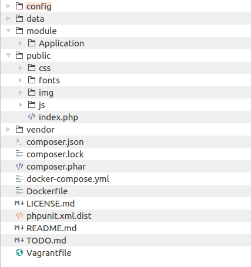

title: Formation Zend framework 3
author:
  name: Mohamed Cherif BOUCHELAGHEM
  twitter: cherif_b
  github: cherifGsoul
  url: http://cherifbouchelaghem.com
output: index.html
controls: false
theme: theme

--
##
### Objectif
* Comprendre et utiliser ZEND framework
* Etre capable de mettre en place et gérer une application avec Zend Framework

--
### Plan de la formation
#### Jour 1
* Introduction au Zend Framework 3
* Rappel PHP OO et PHP avancé
* Présentation de l'approche MVC: Modèle Vue Controleur
* Installation et configuration d'une application ZF 2
* Les Modules

#### Jour 2
* Les Contrôleurs
* Le Routes
* Les Vues
--
### Plan de la formation
#### Jour 3
* Gestion de bases de données
* Gestion des formulaires

#### Jour 4 et 5
* Etude de Cas

--
### Introduction
Zend Framework 3 est un framework libre et open-source PHP. Son développement est guidé (et parrainé) par Zend Technologies, qui est également connu comme le fournisseur de la langue PHP. La première version (Zend Framework 1) a été publiée en 2007; Zend Framework 2, la deuxième version de ce logiciel, a été publié en Septembre 2012. Zend Framework 3 a été publié en Juin 2016.

--
### Introduction

Zend Framework 3 vous offre les fonctionnalités suivantes:
* Développez votre application beaucoup plus rapidement que lorsque vous l'écrivez en PHP pur. ZF3 fournit de nombreux composants qui peuvent être utilisés comme base de code pour créer votre application.
* Coopération plus facile avec les autres membres de l'équipe de construction de votre site. Model-View-Controller modèle utilisé par ZF3 permet de séparer la logique métier et la couche de présentation de votre application, rendant sa structure cohérente et maintenable.
* Extensier votre application avec le concept de modules. ZF3 utilise le terme module, permettant de séparer les pièces du site découplé, permettant ainsi de réutiliser les modèles, les vues, les contrôleurs et les ressources de votre site dans d'autres travaux.
--
### Introduction
* Accès à la base de données de manière orientée objet. Au lieu d'interagir directement avec la base de données à l'aide de requêtes SQL, vous pouvez utiliser Doctrine Object-Relational Mapping (ORM) pour gérer la structure et les relations entre vos données. Avec Doctrine, vous mappez votre table de base de données à une classe PHP (également appelée une classe d'entité) et une ligne de cette table est mappée à une instance de cette classe. Doctrine permet d'abstraire le type de base de données et de rendre le code plus facile à comprendre.
* Ecrire des sites Web sécurisés avec des composants fournis par ZF3, comme des filtres d'entrée de formulaire et des validateurs, des échappements de sortie HTML et des algorithmes de cryptographie, des contrôles humains (Captcha) et Cross-Site Request Forgery (CSRF).
--
### Rappel PHP OO et PHP avancé
#### Les classes abstraites
* Sont des classes qu'on peut pas instanciées
* Contienent des méthodes concrétes et des méthodes abstraites
* Lors de l'héritage d'une classe abstraite, toutes les méthodes marquées comme abstraites dans la déclaration de la classe parente doivent être définies par l'enfant, même le constructeur (5.4).

Exemple:
``` php
abstract class AbstractTask {

  public function assignOwner($owner)
  {
    $this->owner = $owner;
  }

  abstract public function calculateProgression();
}
```
--
### Rappel PHP OO et PHP avancé
#### Les interfaces
* Les interfaces objet vous permettent de créer du code qui spécifie quelles méthodes une classe doit implémenter, sans avoir à définir comment ces méthodes fonctionneront.
* Les interfaces sont définies en utilisant le mot-clé interface, de la même façon que pour une classe standard, mais sans qu'aucune des méthodes n'ait son contenu de spécifié.
* De par la nature même d'une interface, toutes les méthodes déclarées dans une interface doivent être publiques.

Exemple:
``` php
interface BookingServiceInterface
{
  public function bookRoom($customerId,$roomId);
  public function bookSuite($customerId,$roomId);
}
```

--
### Rappel PHP OO et PHP avancé
#### Les traits (5.4)
* Les traits sont un mécanisme de réutilisation de code dans un langage à héritage simple tel que PHP.
* Un trait tente de réduire certaines limites de l'héritage simple, en autorisant le développeur à réutiliser un certain nombre de méthodes dans des classes indépendantes. La sémantique entre les classes et les traits réduit la complexité et évite les problèmes typiques de l'héritage multiple et des Mixins.

--
### Rappel PHP OO et PHP avancé
#### Les méthodes magiques

* Les « méthodes magiques », qui sont toujours préfixées par ‘__’ sont
utilisées par PHP pour exécuter automatiquement du code lorsqu’un
événement se produit.

```
__construct(), __destruct(), __call(), __callStatic(), __get(), __set(),
__isset(), __unset(), __sleep(), __wakeup(), __toString(),
__invoke(), __set_state() __clone() et __debugInfo()
```
--
### Rappel PHP OO et PHP avancé
####Les espaces de noms
Dans le monde PHP, les espaces de noms sont conçus pour résoudre
deux problèmes que rencontrent les auteurs de librairies et
d'applications lors de la réutilisation d'éléments tels que des classes
ou des bibliothèques de fonctions :
1. Collisions de noms entre le code que vous créez, les classes, fonctions ou
constantes internes de PHP, ou celles de librairies tierces.
2. La capacité de faire des alias ou de raccourcir des Noms_Extremement_Long
pour aider à la résolution du premier problème, et améliorer la lisibilité du
code.

--
### Rappel PHP OO et PHP avancé
####Les espaces de noms
* Bien que du code PHP valide puisse être contenu dans un espace de noms, seuls les types de code suivants peuvent être affectés par les espaces de noms : les classes (incluants les abstraites et les traits), les interfaces, les fonctions et les constantes.
* Les espaces de noms sont déclarés avec le mot-clé namespace. Un fichier contenant un espace de noms doit déclarer l'espace au début du fichier, avant tout autre code, avec une seule exception : le mot clé ```declare```.

Exemple:
```php
namespace App\Db\Table;
```
* Les segments de l’espace de nom sont séparés par un '\'

--
### Rappel PHP OO et PHP avancé
####Les espaces de noms
* Une classe est appelée avec son espace de noms
Exemple:
```php
use App\Db\Table\UserTable;
// Où
new \App\Db\Table\UserTable($params);
```
* Une classe peut être liée à un alias qui sera ensuite utilisé dans le code :
```php
use App\Db\Table\UserTable as MemberTable;
// quelque part dans le code
new MemberTable;
```
--
### Rappel PHP OO et PHP avancé
####L'Autoloading (Chargment automatique)

* Les espaces de noms ne sont pas (eux) magiques.
* Leur rôle est de discriminer les noms.
* Pour trouver et charger la classe, il faut, en plus, écrire une fonction
__autoload() qui, en fonction de l’espace de nom, saura retrouver le
fichier à un placement donné sur le serveur.
* La limite de __autoload est qu'elle est une seul fonction
* Avec spl_autoload_register plus qu'un seul autoloader peut être enregistrer
* Utilisez toujours un autloader prêt à l'emploi (Composer)
* Créez votre namespace en suivant les standards PSR-0 (dépricié), PSR-4.

--
### Présentation de l'approche MVC: Modèle Vue Côntroleur

##
--
### Présentation de l'approche MVC: Modèle Vue Côntroleur
#### Modèle (M)

* cette partie gère les données de votre site. Son rôle est d'aller récupérer les informations « brutes » dans la base de données, de les organiser et de les assembler pour qu'elles puissent ensuite être traitées par le contrôleur. On y trouve donc les requêtes SQL.

--
### Présentation de l'approche MVC: Modèle Vue Controleur
#### Vue (V)

* cette partie se concentre sur l'affichage. Elle ne fait presque aucun calcul et se contente de récupérer des variables pour savoir ce qu'elle doit afficher. On y trouve essentiellement du code HTML mais aussi quelques boucles et conditions PHP très simples, pour afficher par exemple la liste des messages des forums.


--
### Présentation de l'approche MVC: Modèle Vue Controleur
#### Côntrolleur (C)

* cette partie gère la logique du code qui prend des décisions. C'est en quelque sorte l'intermédiaire entre le modèle et la vue : le contrôleur va demander au modèle les données, les analyser, prendre des décisions et renvoyer le texte à afficher à la vue. Le contrôleur contient exclusivement du PHP. C'est notamment lui qui détermine si le visiteur a le droit de voir la page ou non (gestion des droits d'accès).

--
### Présentation de l'approche MVC: Modèle Vue Controleur
#### Avantages
* L’architecture MVC schématise des rapports très clairs entre les différents composants de l’application
* Son fonctionnement n’est pas hiérarchique, ce qui autorise les vues à envoyer des requêtes directement au modèle.
* Elle facilite le partage des tâches en matière de développement (entreles différents métiers).
* Les relations entre les composants sont à priori asynchrones.

--
### Présentation de l'approche MVC: Modèle Vue Controleur
#### Limites

* MVC est surtout conçu pour gérer le rafraîchissement simultané de plusieurs vues, ce qui n’est pas le cas des applications web (peut-être à venir avec les WebSockets)
* Dans les applications web, il y a une ambiguïté sur les vues qui sont à la fois des pages et le code exécuté par le navigateur et le code côté serveur chargé de composer l’interface (les moteurs de template)
* Une approche moderne de contrôleurs minces laisse de côté toute une partie du code qui ne se retrouve pas non plus dans le modèle
* L’interprétation de MVC varie énormément entre les implémentations

--
### Installation d'une application ZF 3
#### Avec l'application Skeleton
* L'installation d'une application Zend Framework 3 se fait a l'aide de composer avec la commande:

```composer create-project -sdev zendframework/skeleton-application chemin/de/application```
* Cette commande  installe la derniére version stable
* La derniére version stable pendant qu'on fais ce cours est 3.0.0 pour PHP >= 5.6 et 2.5.3 pour PHP < 5.6


--
### Installation d'une application ZF 3
#### Structure de répertoire type
##

--
### Installation d'une application ZF 3
#### Structure de répertoire

##### Les fichiers

* ```composer.json``` c'est le fchier JSON pour la configuration de composer
* ```composer.lock``` fichier contient les informations des packages installés avec composer.
* ```docker-compose.yml``` et ```Dockerfile``` Sont des fichiers auxiliaires utilisés seulement si vous utilisez Doker.
* ```LICENSE.md``` le fichier de la license ZF3
* ```phpunit.xml.dist``` fihcier de configuration phpunit
* ```README.md``` Une breve description de "skeleton application", pratiquement vous allez le changer par les iformations de votre Application
* ```TODO.md``` un fichier auxiliaire qui peut être supprimer
--
### Installation d'une application ZF 3
##### Les Dossiers
* ```config``` contient les fichiers de configuration de l'application
* ```data``` contient les données que notre application peut généré, il peut contient le cache utilisé pour augmenter la performance
* ```module``` contient les modules de l'application, pour le moment il contient un seul module, s'appel ```Application```
* ```vendor``` ce repertoire contient les librairie tierce, en occurence ZF3 lui même
* ```public``` si le seul répertoire accessible par l'utilisateur final (L'internaute), à travers ```index.php```

--
### Configuration d'une application ZF 3
##

--
### Configuration d'une application ZF 3
####Fichiers de configuration au niveau de l'application
* ```application.config.php``` Est le fichier de configuration principal. Il est utilisé par l'application au démarrage pour déterminer quels modules d'application doivent être chargés et quels services créer par défaut.
* ```modules.config.php``` est le fichier qui contient la liste des modules utilisé par cette application
En résumé:
* en utilise ```application.config.php``` pour mettre les informations des modules qui doivent être chargés
* Pour les configurations supplémentaires en utilise ```autoload/global.php```
--
### Configuration d'une application ZF 3
####  Fichiers de configuration supplémentaires au niveau de l'application

les fichiers ```config/autoload/global.php``` et les fichiers ```config/autoload/local.php```
définissent respectivement les paramètres dépendant de l'environnement et de l'environnement
à l'échelle de l'application. Ces fichiers de configuration sont automatiquement
chargés et fusionnés de manière récursive avec les fichiers de configuration fournis par module,
c'est pourquoi leur répertoire est nommé ```autoload```.

--
### Configuration d'une application ZF 3
####Fichier de configuration du développement au niveau de l'application
* Le fichier de configuration de développement au niveau de l'application (config/development.config.php)
s'affiche uniquement lorsque vous activez le mode de développement.

* Vous activez le mode de développement avec la commande suivante:
```composer development-enable```
* Le fichier ```development.config.php``` est fusionné avec le fichier principal application.config.php. Cela vous permet de remplacer certains paramètres. Par exemple, vous pouvez:
  * Désactivez la mise en cache des configurations. Lorsque vous développez votre application,
  vous modifiez fréquemment vos fichiers de configuration, de sorte que la mise en
  cache des configurations peut avoir des conséquences indésirables, comme l'impossibilité
   de voir immédiatement le résultat de vos modifications.
  * Charger des modules supplémentaires. Par exemple, vous ne pouvez charger le module ZendDeveloperTools qu'en mode de développement.
--
### Configuration d'une application ZF 3
####Fichier de configuration du développement au niveau de l'application
* Si vous désactivez le mode de développement, le fichier ```development.config.php``` sera supprimé.
Donc, vous ne devez pas stocker ce fichier dans le systéme de contrôle de version (GIT, SVN).
* Au lieu de cela, stockez sa version de distribution, ```development.config.php.dist``` dans le systéme de contrôle de version.
--
### Configuration d'une application ZF 3
####Fichiers de configuration de développement supplémentaire au niveau de l'application

* Le fichier de configuration de développement supplémentaire au niveau de l'application
(config/autoload/development.local.php) s'affiche uniquement lorsque vous activez le mode de développement.
* Le fichier ```development.local.php``` est fusionné avec d'autres fichiers de configuration au niveau module.
Cela vous permet de remplacer certains paramètres spécifiques au module utilisés
dans l'environnement de développement uniquement.

* Si vous désactivez le mode de développement, le fichier ```development.local.php``` sera supprimé.
Donc, vous ne devez pas stocker ce fichier sous le contrôle de version.
Au lieu de cela, stockez sa version de distribution, ```development.local.php.dist``` dans systéme de contrôle de version.

--
### Configuration d'une application ZF 3
#### Combinaison des fichiers de configuration
Lors de la création d'une application, les fichiers de configuration fournis par le module
et les fichiers de configuration supplémentaires du répertoire ```config/autoload``` sont fusionnés
en un seul grand réseau imbriqué, de sorte que chaque paramètre de configuration devient
accessible à tout élément du application. Ainsi, potentiellement, vous êtes en mesure de remplacer
certains paramètres spécifiés par les modules.

--
### Configuration d'une application ZF 3
#### Ordre de chargement des fichiers de configuration

Les fichiers de configuration sont chargés dans l'ordre suivant:
* Le fichier principal ```application.config.php``` est chargé en premier.
Il sert à initialiser le gestionnaire de services et à charger des modules d'application.
Les données chargées depuis cette configuration sont stockées seules et ne sont pas fusionnées
avec d'autres fichiers de configuration.
* Les fichiers de configuration de chaque module d'application sont chargés et fusionnés.
Les modules sont chargés dans le même ordre qu'ils sont répertoriés dans le fichier ```application.config.php```.
--
### Configuration d'une application ZF 3
#### Ordre de chargement des fichiers de configuration
* Si deux modules stockent (intentionnellement ou par erreur) des paramètres dans les clés de noms similaires, ces paramètres peuvent être écrasés.
* Les fichiers de configuration supplémentaires du dossier ```config/autoload``` sont chargés et fusionnés en un seul tableau. Ensuite, ce tableau est fusionné avec le tableau de configuration du module produit à l'étape précédente, lors du chargement de la configuration du module. La configuration à l'échelle de l'application a une priorité supérieure à celle de la configuration du module, vous pouvez donc remplacer la configuration de module ici, si vous le souhaitez.
--
### Les modules
#### Qu'est-ce qu'un "Module" ?
* Un module est une unité autonome et réutilisable de votre application.
* Par défaut, votre application possède le module Application uniquement.
* Et il est normal de mettre vos modèles, vues et contrôleurs dans ce module (Application), en particulier dans une application simple.

--
### Les modules
#### Les modules de l'application
* Les modules d'une application ZF sont hébergés (par defaut) dans le dossier ```Module```
---
### Les modules
#### Les modules tierces
* Les modules tierces sont hébergés dans le dossier ```vendor``` dans leurs propre dossier.
* Exemples d'un module tierce:
  * Framework modules comme, Zf TOOLS, Zf Db, ZfValidators
  * Doctrine ORM module.

---
### Les modules
#### Configuration d'un module
* le fichier de config d'un module se retrouve dans ```module/NomDuModule/config/module.config.php```
* la configuration d'un module peut être modifier au niveau de la configuration de l'application
